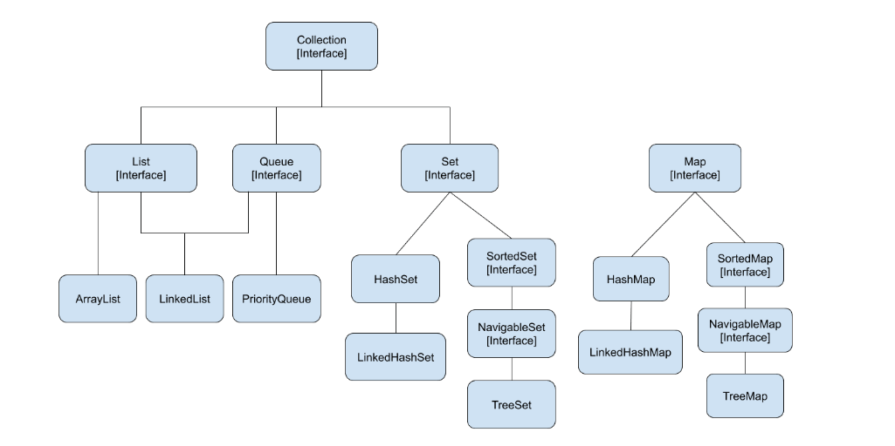

# Java Basics

## 1. Explain the main idea behind _Java_ and the concept of _Write Once, Run Anywhere_.
Java is platform independent ,object-oriented programming language. 
1. Byte code - Java source code is complied into platform-independent byte code which can be executed by an JVM.
Java byte code can be executed on any device with a compatible JVM from smartphones to computer.
2. JVM - Java virtual machine has its own run time environment which executes byte code. JVM is platform dependent, because every
operating environment has its own JVM. 


## 2. What are the main features of Java?
1. Platform Independent- Write once, run anywhere.
2. Object-Oriented- Emphasizes on classes and objects, therefore promoting OOPS concepts.
3. Secure - Java programs runs inside a virtual machine, therefore it's secure.


## 3. Difference between JDK, JVM and JRE?

JVM-
1. JVM Interprets Java byte code into machine specific instructions
2. Memory Management - Handles memory management include garbage collection.
3. JIT compilation - Converts byte code to machine code.
4. Exception Handling - Manages exception handling.

JRE-
The JRE (Java Runtime Environment) is the minimum environment required to execute a Java application.

JDK-
JDK includes development kit, providing everything need to for java application development.
javac: The Java compiler
java: The Java application launcher

# Java Wrapper Classes

## 4. Can you explain the difference between an int and an Integer in Java?

#### int
- **Primitive data type**
- Memory allocation: Fixed $32$ bits (or $4$ bytes)
- Instantiation: Direct, no constructor required
- Default value: $0$
- Performance: Generally faster due to direct value storage

#### Integer
- **Wrapper class** for the primitive `int`
- Provides additional functionality via class methods
- Memory allocation: Variable, typically more than `int`
- Instantiation: Through constructor, auto-boxing, or `valueOf()`
- Default value: `null` (if not assigned)
- Performance: Slightly slower due to object overhead

## 5. What are _wrapper classes_ in _Java_?

**Wrapper classes** in Java allow you to work with primitive data types as objects. They are particularly useful when working with generic collections or when using features that require objects, such as **Java Bean properties**.

Wrapper classes not only provide a way to convert primitives to and from objects but also offer various utility methods specific to each primitive type.

### Core Wrapper Classes

Integer.parseInt --> While working upon strings, there are times when we need to convert a number represented as string to integer type. We can use parseInt method from Integer class. It takes string as parameter and parses it into primitive data type int.

public static int parseInt(String s) throws NumberFormatException

int num = Integer.parseInt(str);

| Primitive | Wrapper Class | Conversion Methods | Primitive Example | Wrapper Example |
| --- | --- | --- | --- | --- |
| `boolean` | `Boolean` | `.valueOf()` <br> `.parseBoolean()` <br> `.booleanValue()` | `true` | `Boolean.TRUE` |
| `byte` | `Byte` | `.valueOf()` <br> `.parseByte()` <br> `.byteValue()` | `123` | `Byte.valueOf((byte)123)` |
| `char` | `Character` | `.valueOf()` <br> `.charValue()` | `'a'` | `Character.valueOf('a')` |
| `short` | `Short` | `.valueOf()` <br> `.parseShort()` <br> `.shortValue()` | `123` | `Short.valueOf((short)123)` |
| `int` | `Integer` | `.valueOf()` <br> `.parseInt()` <br> `.intValue()` | `123` | `Integer.valueOf(123)` |
| `long` | `Long` | `.valueOf()` <br> `.parseLong()` <br> `.longValue()` | `123L` | `Long.valueOf(123L)` |
| `float` | `Float` | `.valueOf()` <br> `.parseFloat()` <br> `.floatValue()` | `123.45f` | `Float.valueOf(123.45f)` |
| `double` | `Double` | `.valueOf()` <br> `.parseDouble()` <br> `.doubleValue()` | `123.45` | `Double.valueOf(123.45)` |

### Use Cases for Wrapper Classes

#### 1. Collections

Collections in Java require objects, not primitives. Wrapper classes allow you to use primitives in these collections.

```java
List<Integer> numbers = new ArrayList<>();
numbers.add(5);  // Autoboxing: int to Integer
int num = numbers.get(0);  // Unboxing: Integer to int
```

#### 2. Nullability

Wrapper classes can represent the absence of a value using `null`, which primitives cannot.

```java
Integer age = null;  // Valid
int primitiveAge = null;  // Compilation error
```

#### 4. Utility Methods

Wrapper classes provide useful utility methods for their respective types.

```java
String binaryString = Integer.toBinaryString(42);
int maxValue = Integer.MAX_VALUE;
boolean isDigit = Character.isDigit('7');
```
<br>

# Object-Oriented Basics

## 6. Is _Java_ a pure _object-oriented language_? Why or why not?

Java is **not** a pure object-oriented language. While it incorporates many object-oriented programming (OOP) principles, it retains some elements from procedural programming.

### Object-Oriented Features in Java

Java supports the four main pillars of OOP:

1. **Encapsulation**: Achieved through access modifiers (`public`, `private`, `protected`).
2. **Abstraction**: Implemented via abstract classes and interfaces.
3. **Inheritance**: Supported using the `extends` keyword for classes and `implements` for interfaces.
4. **Polymorphism**: Realized through method overloading and overriding.

### Non-Pure OOP Elements in Java

1. **Primitive Data Types**: Java includes non-object primitives like `int`, `boolean`, `char`, etc.

2. **Static Members**: The `static` keyword allows for class-level fields and methods, not tied to object instances.

3. **Procedural Constructs**: Java supports procedural programming elements such as control flow statements (`if`, `for`, `while`, etc.).


# Strings

## Why are String immutable in Java?
1. String are immutable in java means, once a String object is created it cannot be modified.
2. String pool is only possible because of immutable behavior.Different String variables can refer to same object in pool.
3. Since String is immutable, it is safe for multi threading. A single String instance can be shared across different threads.

# Object-Oriented Concepts

## Inheritance-
1. Single Inheritance- When a class inherits properties and behavior of only one class.
2. Hierarchical Inheritance- When multiple class inherits the properties and behavior of one class, its called as Hierarchical Inheritance.
ex-
3. In selenium project we have BasePage abstract class which extends multiple page classes.

4. Multiple Inheritance is not supported in Java, because if one class inherits same method from multiples parent class then compiler cannot decide method from which classes it needs
to invoke. 

## Polymorphism- 
Means same thing in different form.
1. Method Overloading- Same method name with different number of parameters and type of parameters.
2. In Selenium project we have 2 selectDropDown methods which has same but different signatures.

3. Method Overriding - Same method name with same signature, just the implementation changes.

## Abstraction-
Hiding the implementation and showing only functionality to user.
1. Using Abstract Class - In our selenium project we have BasePage abstract class which has common methods for all the child page classes. In this BasePage abstract 
class we can define abstract and non-abstract methods.

2. Interface includes only abstract methods. 100% abstraction.

## Encapsulation-
1. Binding the data and methods together. Defining private variables and using public getters and setters.


## Q. What is final in Java?
final is a keyword used in java. final for a class means it cannot be extended. Ex We have Properties class in utils package which is a final class.
final for a variable means its value is constant and cannot be modified.
final for method means it cannot be overridden.


## Q. What is static in Java?
Static means attached to the class. For example if we have a variable in a class that will have same value for all the objects, we can make it static so it be directly accessed and  that way we save memory.
Ex 3 cars having same color as red, we can make color as static.
static variables or methods can be directly accessed and doesn't need object creation.


# Collections

## Q. What is Java Collections Framework? List out some benefits of Collections framework?


The Collection in Java is a framework that provides an architecture to store and manipulate the group of objects. Java Collections can achieve all the operations that we perform on a data such as searching, sorting, insertion, manipulation, and deletion.

Java Collection means a single unit of objects. Java Collection framework provides many interfaces (Set, List, Queue, Deque) and classes (ArrayList, Vector, LinkedList, PriorityQueue, HashSet, LinkedHashSet, TreeSet).

**Collection Interface**

Collection interface is at the root of the hierarchy. Collection interface provides all general purpose methods which all collections classes must support (or throw UnsupportedOperationException). It extends **Iterable** interface which adds support for iterating over collection elements using the “for-each loop” statement.

**1. List**

Lists represents an **ordered collection** of elements. Using lists, we can access elements by their integer index (position in the list), and search for elements in the list. index start with 0, just like an array.

Some useful classes which implement List interface are – **ArrayList**, **CopyOnWriteArrayList**, **LinkedList**, **Stack** and **Vector**.

**2. Set**

Sets represents a collection of **sorted** elements. Sets do not allow the duplicate elements. Set interface does not provides no guarantee to return the elements in any predictable order; though some Set implementations store elements in their natural ordering and guarantee this order.

Some useful classes which implement Set interface are – **ConcurrentSkipListSet**, **CopyOnWriteArraySet**, **EnumSet**, **HashSet**, **LinkedHashSet** and **TreeSet**.


**3. Queue**
A queue data structure is intended to hold the elements (put by producer threads) prior to processing by consumer thread(s). Besides basic Collection operations, queues provide additional insertion, extraction, and inspection operations.

Some useful classes which implement Map interface are – **ArrayBlockingQueue, ArrayDeque, ConcurrentLinkedDeque, ConcurrentLinkedQueue, DelayQueue, LinkedBlockingDeque, LinkedBlockingQueue, LinkedList, LinkedTransferQueue, PriorityBlockingQueue, PriorityQueue and SynchronousQueue**.

### Difference between List and Set in Java?
1. List is ordered, set is unordered.
2. List allows duplicates, set doesn't allow duplicates.
3. List allows null values, set allows a single null.

**Map**

The Map interface enable us to store data in key-value pairs (keys should be immutable). A map cannot contain duplicate keys; each key can map to at most one value.

The Map interface provides three collection views, which allow a map’s contents to be viewed as a set of keys, collection of values, or set of key-value mappings. Some map implementations, like the TreeMap class, make specific guarantees as to their order; others, like the HashMap class, do not.

Some useful classes which implement Map interface are – **ConcurrentHashMap**, **ConcurrentSkipListMap**, **EnumMap**, **HashMap**, **Hashtable**, **IdentityHashMap**, **LinkedHashMap**, **Properties**, **TreeMap** and **WeakHashMap**.

Linked HashMap- LinkedHashMap is just like HashMap with an additional feature of maintaining an order of elements inserted into it


**The Java Collections Framework provides the following benefits:**

* Reduces programming effort
* Increases program speed and quality
* Allows interoperability among unrelated APIs
* Reduces effort to learn and to use new APIs
* Reduces effort to design new APIs
* Fosters software reuse

**Methods of Collection Interface**

<table class="alt">
<tbody><tr><th>No.</th><th>Method</th><th>Description</th></tr>
<tr><td>1</td><td>public boolean add(Object element)</td><td> is used to insert an element in this collection.</td></tr>
<tr><td>2</td><td>public boolean addAll(Collection c)</td><td>is used to insert the specified collection elements in the invoking collection.</td></tr>
<tr><td>3</td><td>public boolean remove(Object element)</td><td>is used to delete an element from this collection.</td></tr>
<tr><td>4</td><td>public boolean removeAll(Collection c)</td><td>is used to delete all the elements of specified collection from the invoking collection.</td></tr>
<tr><td>5</td><td>public boolean retainAll(Collection c)</td><td>is used to delete all the elements of invoking collection except the specified collection.</td></tr>
<tr><td>6</td><td>public int size()</td><td>return the total number of elements in the collection.</td></tr>
<tr><td>7</td><td>public void clear()</td><td>removes the total no of element from the collection.</td></tr>
<tr><td>8</td><td>public boolean contains(Object element)</td><td>is used to search an element.</td></tr>
<tr><td>9</td><td>public boolean containsAll(Collection c)</td><td>is used to search the specified collection in this collection.</td></tr>
<tr><td>10</td><td>public Iterator iterator()</td><td>returns an iterator.</td></tr>
<tr><td>11</td><td>public Object[] toArray()</td><td>converts collection into array.</td></tr>
<tr><td>12</td><td>public boolean isEmpty()</td><td>checks if collection is empty.</td></tr>
<tr><td>13</td><td>public boolean equals(Object element)</td><td>matches two collection.</td></tr>
<tr><td>14</td><td>public int hashCode()</td><td>returns the hashcode number for collection.</td></tr>
</tbody></table>

## Q. Arrays or Collections?
If you know the size and the data type of elements, you can go with Arrays. Otherwise, go with a collection as a collection can store unlimited number of elements either of the same type or different types. 
Moreover, if you want to reduce coding effort, you can go with Collections, as it offers to use various utility methods. From the performance point of view, Array is better than a collection as utility methods take more time to execute.

## Q. What is the difference between Array and ArrayList data-structure?

* **Resizable**: Array is fixed sized array but ArrayList is dynamic sized array.
* **Primitives**: Array can contain both primitives and objects but ArrayList can contain only object elements

```java
public class ArrayHomogenous {
    public static void main(String args[]){
int[] arr =new int[5];//declaration and instantiation
// boolean[] boolArr = { true, true, false, true };
// char[] charArr = { 'g', 'e', 'e', 'k', 's' };        
arr[0]=10;//initialization
arr[1]=20;
        for(int i=0;i<arr.length;i++)//length is the property of array
            System.out.println(arr[i]);
    }}
```
```java
public class ArrayListHomogeneousAndHeterogeneous {
    public static void main(String[] args) {
        ArrayList myNumbers = new ArrayList();
        myNumbers.add("10");
        myNumbers.add(15);
        myNumbers.add(20);
        for (Object i : myNumbers) {
            System.out.println(i);
        }
    }
}
```

## Q. Homogeneous and Heterogeneous?
Homogeneous: A homogeneous collection in Java contains elements of the same type. For example, an array or a list declared to hold integers (int[], ArrayList<Integer>) is homogeneous because all its elements are of type int or Integer.
int[] numbers = {1, 2, 3, 4, 5};

List<Integer> ls = new ArrayList<>();

Heterogeneous: A heterogeneous collection in Java can contain elements of different types. This is typically achieved using the common ancestor type of all potential elements (like Object), allowing different types of objects to be stored in the same collection.

Object[] mixedArray = {1, "two", 3.0, true};

## Q. What is difference between HashSet and LinkedHashSet?

LinkedHashSet- Maintains insertion order. The only difference between HashSet and LinkedHashSet is that LinkedHashSet maintains the **insertion order**.
The reason why LinkedHashSet maintains insertion order is because the underlying data structure is a doubly-linked list.
HashSet does not maintain insertion order.


## Q. What is the difference between HashTable and HashMap?

HashMap is **non synchronized**. It is not-thread safe and can't be shared between many threads without proper synchronization code.
HashMap allows one null key and multiple null values.


Hashtable is **synchronized**. It is thread-safe and can be shared with many threads.
Hashtable doesn't allow any null key or value.


## Q. What is the difference between Set and Map?

**Sets**:-

1. Set does not  allow duplicates. Set and all the classes which implements Set interface should have unique elements.
2. Set allows single null value at most.
3. Set does not  maintain any order; still few of its classes sort the elements in an order such as LinkedHashSet maintains the elements in insertion order.
4. Classes used in sets are Set: HashSet, Linked HashSet, TreeSet, SortedSet etc.

**Maps**:-

1. Map stored the elements as key & value pair. Map doesn’t allow duplicate keys while it allows duplicate values.
2. Map can have single null key at most and any number of null values.
3. Set Map also doesn’t stores the elements in an order, however few of its classes does the same.
4. Classes in Maps HashMap, TreeMap, WeakHashMap, LinkedHashMap, IdentityHashMap etc.

## Q. What is the difference between HashSet and HashMap?

**HashSet**:-

1. HashSet class implements the Set interface
3. HashSet does not allow duplicate elements that mean you can not store duplicate values in HashSet.
4. HashSet permits to have a single null value.
5. HashSet is not synchronized which means they are not suitable for thread-safe operations until unless synchronized explicitly.


**HashMap**:-

1. HashMap class implements the Map interface
2. HashMap is used for storing key & value pairs. In short, it maintains the mapping of key & value (The HashMap class is roughly equivalent to Hashtable, except that it is unsynchronized and permits nulls.) This is how you could represent HashMap elements if it has integer key and value of String type: e.g. {1->”Hello”, 2->”Hi”, 3->”Bye”, 4->”Run”}
3. HashMap does not allow duplicate keys however it allows having duplicate values.
4. HashMap permits single null key and any number of null values.
5. HashMap is not synchronized which means they are not suitable for thread-safe operations until unless synchronized explicitly.

## Q. Tree Map?
Tree map is used when we require key values pair in sorted ascending order.

## Q. What is the difference between Collection & Collections ?

“Collection” is an interface. If we want to represent a group of individual objects as a single entity, then we should go for Collection.

“Collections” is an utility class present in java.util package to define several utility methods for Collection objects (like sorting, searching, etc).

## Q. Call by value and call by reference?
Call by value- If we call a method by passing the value in the method parameter, this is known as call by value. This does not change original value, just a copy of value is sent to the method.


## Q. Garbage Collections?
Garbage collection is a mechanism where JVM deletes unreferenced objects from memory and it runs finalize method before running this process.

## Q. Upcasting and Downcasting in Java?

# Exception Handling 


 


