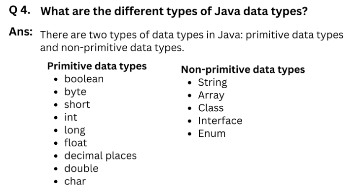
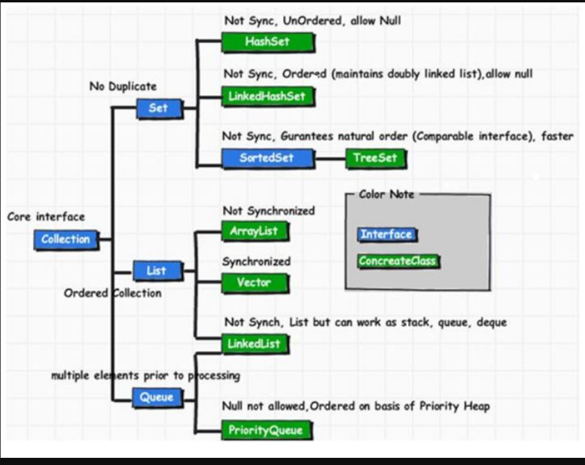
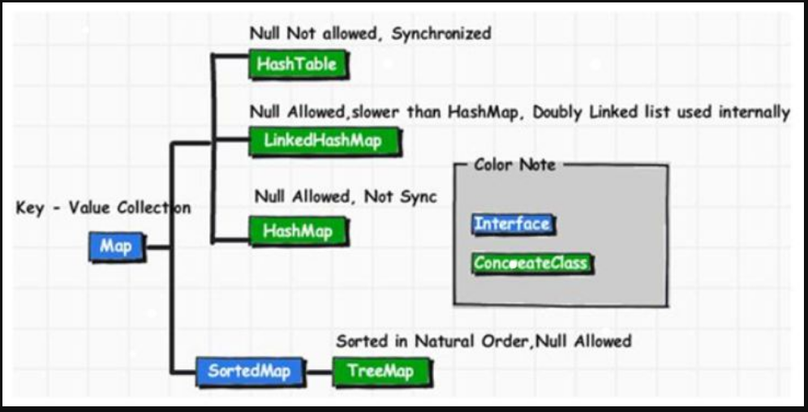
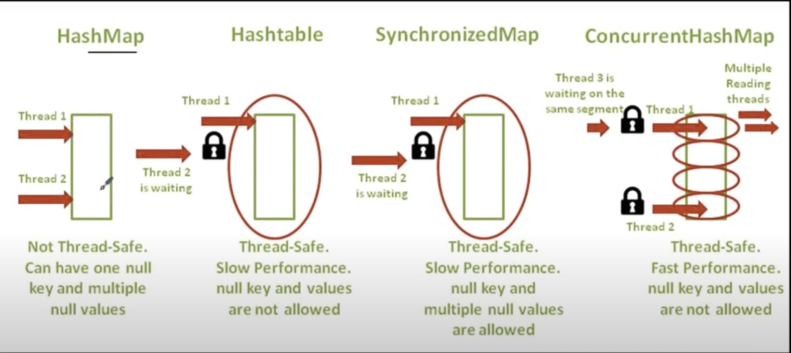
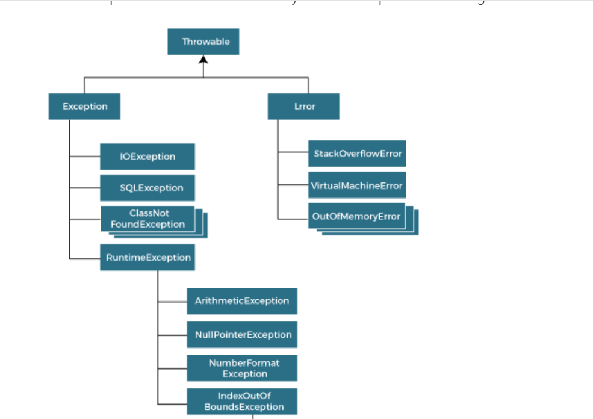
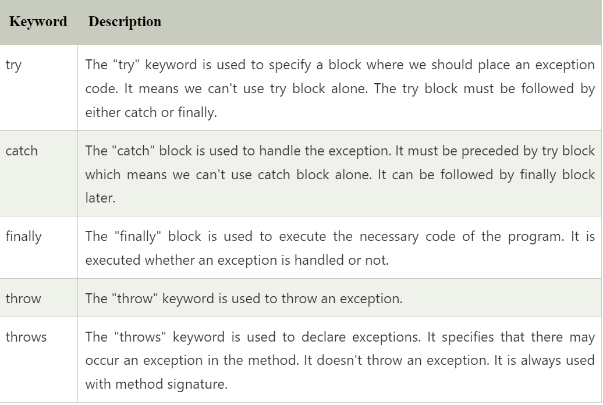
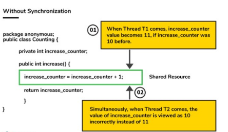
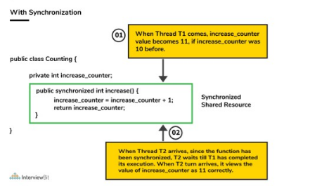
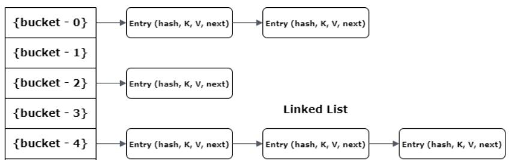

# Java Basics

## 1. Explain the main idea behind _Java_ and the concept of _Write Once, Run Anywhere_.
Java is platform independent ,object-oriented programming language. 
1. Byte code - Java source code is complied into platform-independent byte code which can be executed by an JVM.
Java byte code can be executed on any device with a compatible JVM from smartphones to computer.
2. JVM - Java virtual machine has its own run time environment which executes byte code. JVM is platform dependent, because every
operating environment has its own JVM. 


## 2. What are the main features of Java?
1. Platform Independent- Write once, run anywhere.
2. Object-Oriented- Emphasizes on classes and objects, therefore promoting OOPS concepts.
3. Secure - Java programs runs inside a virtual machine, therefore it's secure.


## 3. Difference between JDK, JVM and JRE?

JVM-
1. JVM Interprets Java byte code into machine specific instructions
2. Memory Management - Handles memory management include garbage collection.
3. JIT compilation - Converts byte code to machine code.
4. Exception Handling - Manages exception handling.

JRE-
The JRE (Java Runtime Environment) is the minimum environment required to execute a Java application.

JDK-
JDK includes development kit, providing everything need to for java application development.
javac: The Java compiler
java: The Java application launcher

## 4. Different data types in java?
There are 2 data types in java. Primitive data type and non primitive data type in java.




## 5. Difference between Heap and Stack Memory?

1. Stack Memory -> When we write a program, then all variables, methods and object reference are stored in stack memory.
2. Heap Memory -> When we create an object, the object is stored in heap memory and reference is stored in stack.
The object is created at run time and heap memory is available for run time things. Heap memory is like a big storage.


## 6. Difference between instance variables and local variables?

1. Instance variables -> are variables declared outside the method but inside the class.These variables belong to object and we access them using object creation.
2. Local Variables -> are variables present inside block, method or constructor and its access is limited within them.


## 7. What is the significance of using super to call a constructor from a super class with parameters.
Using super(parameters) ensures that super class constructors is called with necessary parameters, initializing inherited fields.


## 8. How does this assist in resolving conflicts between instance variables and method parameters in a class?
This keyword refers to current class instance variables and is used to differentiate local variables and instance variables when they have same name.

## 9. What is the role of abstract class in defining a common structure for multiple classes?
Abstract class defines common methods, providing a base that multiple other classes and extend and use.

## 10. How does method overloading helps in writing more flexible and reusable test methods?
Method overloading allows multiple methods with same name but different no and type pf parameters, therefor making it more flexible and reusable.

## 11. What is th significance of using interface to define common set of methods for test classes?
Interface defines a common set of methods that test classes should implement, ensuring a standardized approach.
Interface must define a contract that multiple class should adhere.

## 12. 
# Java Wrapper Classes

## 13. Can you explain the difference between an int and an Integer in Java?

#### int
- **Primitive data type**
- Memory allocation: Fixed $32$ bits (or $4$ bytes)
- Instantiation: Direct, no constructor required
- Default value: $0$
- Performance: Generally faster due to direct value storage

#### Integer
- **Wrapper class** for the primitive `int`
- Provides additional functionality via class methods
- Memory allocation: Variable, typically more than `int`
- Instantiation: Through constructor, auto-boxing, or `valueOf()`
- Default value: `null` (if not assigned)
- Performance: Slightly slower due to object overhead

## 14. What are _wrapper classes_ in _Java_?

**Wrapper classes** in Java allow you to work with primitive data types as objects. They are particularly useful when working with generic collections or when using features that require objects, such as **Java Bean properties**.

Wrapper classes not only provide a way to convert primitives to and from objects but also offer various utility methods specific to each primitive type.

### Core Wrapper Classes

Integer.parseInt --> While working upon strings, there are times when we need to convert a number represented as string to integer type. We can use parseInt method from Integer class. It takes string as parameter and parses it into primitive data type int.

public static int parseInt(String s) throws NumberFormatException

int num = Integer.parseInt(str);

| Primitive | Wrapper Class | Conversion Methods | Primitive Example | Wrapper Example |
| --- | --- | --- | --- | --- |
| `boolean` | `Boolean` | `.valueOf()` <br> `.parseBoolean()` <br> `.booleanValue()` | `true` | `Boolean.TRUE` |
| `byte` | `Byte` | `.valueOf()` <br> `.parseByte()` <br> `.byteValue()` | `123` | `Byte.valueOf((byte)123)` |
| `char` | `Character` | `.valueOf()` <br> `.charValue()` | `'a'` | `Character.valueOf('a')` |
| `short` | `Short` | `.valueOf()` <br> `.parseShort()` <br> `.shortValue()` | `123` | `Short.valueOf((short)123)` |
| `int` | `Integer` | `.valueOf()` <br> `.parseInt()` <br> `.intValue()` | `123` | `Integer.valueOf(123)` |
| `long` | `Long` | `.valueOf()` <br> `.parseLong()` <br> `.longValue()` | `123L` | `Long.valueOf(123L)` |
| `float` | `Float` | `.valueOf()` <br> `.parseFloat()` <br> `.floatValue()` | `123.45f` | `Float.valueOf(123.45f)` |
| `double` | `Double` | `.valueOf()` <br> `.parseDouble()` <br> `.doubleValue()` | `123.45` | `Double.valueOf(123.45)` |

### Use Cases for Wrapper Classes

#### 1. Collections

Collections in Java require objects, not primitives. Wrapper classes allow you to use primitives in these collections.

```java
List<Integer> numbers = new ArrayList<>();
numbers.add(5);  // Autoboxing: int to Integer
int num = numbers.get(0);  // Unboxing: Integer to int
```

#### 2. Nullability

Wrapper classes can represent the absence of a value using `null`, which primitives cannot.

```java
Integer age = null;  // Valid
int primitiveAge = null;  // Compilation error
```

#### 4. Utility Methods

Wrapper classes provide useful utility methods for their respective types.

```java
String binaryString = Integer.toBinaryString(42);
int maxValue = Integer.MAX_VALUE;
boolean isDigit = Character.isDigit('7');
```
<br>

# Object-Oriented Basics

## 15. Is _Java_ a pure _object-oriented language_? Why or why not?

Java is **not** a pure object-oriented language. While it incorporates many object-oriented programming (OOP) principles, it retains some elements from procedural programming.

### Object-Oriented Features in Java

Java supports the four main pillars of OOP:

1. **Encapsulation**: Achieved through access modifiers (`public`, `private`, `protected`).
2. **Abstraction**: Implemented via abstract classes and interfaces.
3. **Inheritance**: Supported using the `extends` keyword for classes and `implements` for interfaces.
4. **Polymorphism**: Realized through method overloading and overriding.

### Non-Pure OOP Elements in Java

1. **Primitive Data Types**: Java includes non-object primitives like `int`, `boolean`, `char`, etc.

2. **Static Members**: The `static` keyword allows for class-level fields and methods, not tied to object instances.

3. **Procedural Constructs**: Java supports procedural programming elements such as control flow statements (`if`, `for`, `while`, etc.).


# Strings

## 16. Why are String immutable in Java?
1. String are immutable in java means, once a String object is created it cannot be modified.
2. String pool is only possible because of immutable behavior.Different String variables can refer to same object in pool.
3. Since String is immutable, it is safe for multi threading. A single String instance can be shared across different threads.

# Object-Oriented Concepts

## Inheritance-
1. Single Inheritance- When a class inherits properties and behavior of only one class.
2. Hierarchical Inheritance- When multiple class inherits the properties and behavior of one class, its called as Hierarchical Inheritance.
ex-
3. In selenium project we have BasePage abstract class which extends multiple page classes.

4. Multiple Inheritance is not supported in Java, because if one class inherits same method from multiples parent class then compiler cannot decide method from which classes it needs
to invoke. 

## Polymorphism- 
Means same thing in different form.
1. Method Overloading- Same method name with different number of parameters and type of parameters.
2. In Selenium project we have 2 selectDropDown methods which has same but different signatures.

3. Method Overriding - Same method name with same signature, just the implementation changes.

## Abstraction-
Hiding the implementation and showing only functionality to user.
1. Using Abstract Class - In our selenium project we have BasePage abstract class which has common methods for all the child page classes. In this BasePage abstract 
class we can define abstract and non-abstract methods.

2. Interface includes only abstract methods. 100% abstraction.

## Encapsulation-
1. Binding the data and methods together. Defining private variables and using public getters and setters.


## 17. What is final in Java?
final is a keyword used in java. 
1. final for a class means it cannot be extended. Ex We have Properties class in utils package which is a final class.
2. final for a variable means its value is constant and cannot be modified.
3. final for method means it cannot be overridden.


## 18. What is static in Java?
Static means attached to the class. For example if we have a variable in a class that will have same value for all the objects, we can make it static so it be directly accessed and  that way we save memory.
Ex 3 cars having same color as red, we can make color as static.
static variables or methods can be directly accessed and doesn't need object creation.

we have propertiesUtil.java, where we have static map variable as the url, username and password will be same for all the test.

static methods-
1. Methods should not be static if they are using instance variables.
2. If methods are not using instance variables then they can be static.

# Collections

## 19. What is Java Collections Framework? List out some benefits of Collections framework?


The Collection in Java is a framework that provides an architecture to store and manipulate the group of objects. Java Collections can achieve all the operations that we perform on a data such as searching, sorting, insertion, manipulation, and deletion.

Java Collection means a single unit of objects. Java Collection framework provides many interfaces (Set, List, Queue, Deque) and classes (ArrayList, Vector, LinkedList, PriorityQueue, HashSet, LinkedHashSet, TreeSet).

**Collection Interface**

Collection interface is at the root of the hierarchy. Collection interface provides all general purpose methods which all collections classes must support (or throw UnsupportedOperationException). It extends **Iterable** interface which adds support for iterating over collection elements using the “for-each loop” statement.

**1. List**

Lists represents an **ordered collection** of elements. Using lists, we can access elements by their integer index (position in the list), and search for elements in the list. index start with 0, just like an array.

Some useful classes which implement List interface are – **ArrayList**, **CopyOnWriteArrayList**, **LinkedList**, **Stack** and **Vector**.

**2. Set**

Sets represents a collection of **sorted** elements. Sets do not allow the duplicate elements. Set interface does not provides no guarantee to return the elements in any predictable order; though some Set implementations store elements in their natural ordering and guarantee this order.

Some useful classes which implement Set interface are – **ConcurrentSkipListSet**, **CopyOnWriteArraySet**, **EnumSet**, **HashSet**, **LinkedHashSet** and **TreeSet**.


**3. Queue**
A queue data structure is intended to hold the elements (put by producer threads) prior to processing by consumer thread(s). Besides basic Collection operations, queues provide additional insertion, extraction, and inspection operations.

Some useful classes which implement Map interface are – **ArrayBlockingQueue, ArrayDeque, ConcurrentLinkedDeque, ConcurrentLinkedQueue, DelayQueue, LinkedBlockingDeque, LinkedBlockingQueue, LinkedList, LinkedTransferQueue, PriorityBlockingQueue, PriorityQueue and SynchronousQueue**.

## 20. Difference between List and Set in Java?
1. List is ordered, set is unordered.
2. List allows duplicates, set doesn't allow duplicates.
3. List allows null values, set allows a single null.

**Map**

The Map interface enable us to store data in key-value pairs (keys should be immutable). A map cannot contain duplicate keys; each key can map to at most one value.

The Map interface provides three collection views, which allow a map’s contents to be viewed as a set of keys, collection of values, or set of key-value mappings. Some map implementations, like the TreeMap class, make specific guarantees as to their order; others, like the HashMap class, do not.

Some useful classes which implement Map interface are – **ConcurrentHashMap**, **ConcurrentSkipListMap**, **EnumMap**, **HashMap**, **Hashtable**, **IdentityHashMap**, **LinkedHashMap**, **Properties**, **TreeMap** and **WeakHashMap**.

Linked HashMap- LinkedHashMap is just like HashMap with an additional feature of maintaining an order of elements inserted into it





**The Java Collections Framework provides the following benefits:**

* Reduces programming effort
* Increases program speed and quality
* Allows interoperability among unrelated APIs
* Reduces effort to learn and to use new APIs
* Reduces effort to design new APIs
* Fosters software reuse

**Methods of Collection Interface**

<table class="alt">
<tbody><tr><th>No.</th><th>Method</th><th>Description</th></tr>
<tr><td>1</td><td>public boolean add(Object element)</td><td> is used to insert an element in this collection.</td></tr>
<tr><td>2</td><td>public boolean addAll(Collection c)</td><td>is used to insert the specified collection elements in the invoking collection.</td></tr>
<tr><td>3</td><td>public boolean remove(Object element)</td><td>is used to delete an element from this collection.</td></tr>
<tr><td>4</td><td>public boolean removeAll(Collection c)</td><td>is used to delete all the elements of specified collection from the invoking collection.</td></tr>
<tr><td>5</td><td>public boolean retainAll(Collection c)</td><td>is used to delete all the elements of invoking collection except the specified collection.</td></tr>
<tr><td>6</td><td>public int size()</td><td>return the total number of elements in the collection.</td></tr>
<tr><td>7</td><td>public void clear()</td><td>removes the total no of element from the collection.</td></tr>
<tr><td>8</td><td>public boolean contains(Object element)</td><td>is used to search an element.</td></tr>
<tr><td>9</td><td>public boolean containsAll(Collection c)</td><td>is used to search the specified collection in this collection.</td></tr>
<tr><td>10</td><td>public Iterator iterator()</td><td>returns an iterator.</td></tr>
<tr><td>11</td><td>public Object[] toArray()</td><td>converts collection into array.</td></tr>
<tr><td>12</td><td>public boolean isEmpty()</td><td>checks if collection is empty.</td></tr>
<tr><td>13</td><td>public boolean equals(Object element)</td><td>matches two collection.</td></tr>
<tr><td>14</td><td>public int hashCode()</td><td>returns the hashcode number for collection.</td></tr>
</tbody></table>

## 21. Arrays or Collections?
If you know the size and the data type of elements, you can go with Arrays. Otherwise, go with a collection as a collection can store unlimited number of elements either of the same type or different types. 
Moreover, if you want to reduce coding effort, you can go with Collections, as it offers to use various utility methods. From the performance point of view, Array is better than a collection as utility methods take more time to execute.

## 22. What is the difference between Array and ArrayList data-structure?

* **Resizable**: Array is fixed sized array but ArrayList is dynamic sized array.
* **Primitives**: Array can contain both primitives and objects but ArrayList can contain only object elements

```java
public class ArrayHomogenous {
    public static void main(String args[]){
int[] arr =new int[5];//declaration and instantiation
// boolean[] boolArr = { true, true, false, true };
// char[] charArr = { 'g', 'e', 'e', 'k', 's' };        
arr[0]=10;//initialization
arr[1]=20;
        for(int i=0;i<arr.length;i++)//length is the property of array
            System.out.println(arr[i]);
    }}
```
```java
public class ArrayListHomogeneousAndHeterogeneous {
    public static void main(String[] args) {
        ArrayList myNumbers = new ArrayList();
        myNumbers.add("10");
        myNumbers.add(15);
        myNumbers.add(20);
        for (Object i : myNumbers) {
            System.out.println(i);
        }
    }
}
```

## 23. Homogeneous and Heterogeneous?
Homogeneous: A homogeneous collection in Java contains elements of the same type. For example, an array or a list declared to hold integers (int[], ArrayList<Integer>) is homogeneous because all its elements are of type int or Integer.
```java
int[] numbers = {1, 2, 3, 4, 5};
List<Integer> ls = new ArrayList<>();
Object[] mixedArray = {1, "two", 3.0, true};
```

Heterogeneous: A heterogeneous collection in Java can contain elements of different types. This is typically achieved using the common ancestor type of all potential elements (like Object), allowing different types of objects to be stored in the same collection.
```java
ArrayList myNumbers = new ArrayList();
myNumbers.add("10");
myNumbers.add(15);
myNumbers.add(20);
```


## 24. What is difference between HashSet and LinkedHashSet?

LinkedHashSet- Maintains insertion order. The only difference between HashSet and LinkedHashSet is that LinkedHashSet maintains the **insertion order**.
The reason why LinkedHashSet maintains insertion order is because the underlying data structure is a doubly-linked list.
HashSet does not maintain insertion order.


## 25. What is the difference between HashTable and HashMap?

HashMap is **non synchronized**. It is not-thread safe and can't be shared between many threads without proper synchronization code.
HashMap allows one null key and multiple null values.


Hashtable is **synchronized**. It is thread-safe and can be shared with many threads.
Hashtable doesn't allow any null key or value.




## 26. What is the difference between Set and Map?

**Set**:-

1. Set does not  allow duplicates. Set and all the classes which implements Set interface should have unique elements.
2. Set allows single null value at most.
3. Set does not  maintain any order; still few of its classes sort the elements in an order such as LinkedHashSet maintains the elements in insertion order.
4. Classes used in sets are Set: HashSet, Linked HashSet, TreeSet, SortedSet etc.

**Map**:-

1. Map stored the elements as key & value pair. Map doesn’t allow duplicate keys while it allows duplicate values.
2. Map can have single null key at most and any number of null values.
3. Set Map also doesn’t stores the elements in an order, however few of its classes does the same.
4. Classes in Maps HashMap, TreeMap, WeakHashMap, LinkedHashMap, IdentityHashMap etc.

## 27. What is the difference between HashSet and HashMap?

**HashSet**:-

1. HashSet class implements the Set interface
3. HashSet does not allow duplicate elements that mean you can not store duplicate values in HashSet.
4. HashSet permits to have a single null value.
5. HashSet is not synchronized which means they are not suitable for thread-safe operations until unless synchronized explicitly.


**HashMap**:-

1. HashMap class implements the Map interface
2. HashMap is used for storing key & value pairs. In short, it maintains the mapping of key & value (The HashMap class is roughly equivalent to Hashtable, except that it is unsynchronized and permits nulls.) This is how you could represent HashMap elements if it has integer key and value of String type: e.g. {1->”Hello”, 2->”Hi”, 3->”Bye”, 4->”Run”}
3. HashMap does not allow duplicate keys however it allows having duplicate values.
4. HashMap permits single null key and any number of null values.
5. HashMap is not synchronized which means they are not suitable for thread-safe operations until unless synchronized explicitly.

## 28. Tree Map?
Tree map is used when we require key values pair in sorted ascending order.

## 29. What is the difference between Collection & Collections ?

“Collection” is an interface. If we want to represent a group of individual objects as a single entity, then we should go for Collection.

“Collections” is an utility class present in java.util package to define several utility methods for Collection objects (like sorting, searching, etc).

## 30. Call by value and call by reference?
Call by value- If we call a method by passing the value in the method parameter, this is known as call by value. This does not change original value, just a copy of value is sent to the method.


## 31. Garbage Collections?
Garbage collection is a mechanism where JVM deletes unreferenced objects from memory and it runs finalize method before running this process.

## 32. Upcasting and Down casting in Java?
Parent to child is upcasting

Child to parent is downcasting

Parent p = new Child(): 

Upcasting involves assigning superclass reference variable to child class object.This helps to access parent clas members and overridden methods of child class.
Upcasting supports polymorphism.

# Exception Handling 
An Exception is an event that disrupts the normal flow of the program.
Exception Handling is a mechanism to handle runtime errors such as ClassNotFoundException, IOException, SQLException, RemoteException, etc.

Benefits-
1. Prevents program crashes.
2. Provides info about error.
3. Allows to recover from errors.



There are 2 main types of exception-
1. Checked Exception - Compile time exception are known as checked exceptions. IO and SQL
2. Unchecked Exception - Run time exception like arithmetic exception, null pointer exception and all.



## 33. Difference between throw and throws keyword?
Throw is used to deliberately throw an exception whereas throws is used to declare an exception.
Throws will not prevent from occurring exception because we are just declaring.

## 34. How to handle exception in java?
Using try catch block as it will prevent exception from occurring.

## 35. How can you create custom exception

```java

//A Class that represents use-defined exception
class MyException extends Exception{
    public MyException(String msg){
        // Call constructor of parent Exception
        super(msg);
    }
}

// A Class that uses above MyException
public class TestClass {
    // Driver Program
    public static void main(String args[]){
        try{
            // Throw an object of user defined exception
            throw new MyException("Throwing my exception");
        }catch (MyException ex){
            // Print the message from MyException object
            System.out.println(ex.getMessage());
        }
    }
}
```

Readable and self-explanatory--


Custom exception allows you to define your own exception classes for specific situations.
These exceptions can be designed to provide more descriptive messages.
By creating custom exceptions with meaningful names, you can make your test code more readable and self-explanatory. This helps in quickly identifying the nature of failures when reviewing test reports or logs.

if(!homePage.isDisplayed()){
 throw new MyException("Failed");
}

```java
try {
    FileInputStream file = new FileInputStream(FrameworkConstants.getConfigFilePath());
    property.load(file);
    for (Map.Entry<Object, Object> entry : property.entrySet()) {
    CONFIGMAP.put(String.valueOf(entry.getKey()), String.valueOf(entry.getValue()).trim()); //remove the trailing and leading spaces
    }
    //property.entrySet().forEach(entry ->CONFIGMAP.put(String.valueOf(entry.getKey()), String.valueOf(entry.getValue()));
     } catch (Exception e ) {
    throw new PropertyFileException("Please check the Path of the config.properties file");
```

# MultiThreading

## 36. What is multithreading in Java?
Multithreading is a programming concept that allows multiple task to be executed at the same time. In Java multithreading is 
implemented using Thread class.

## 37. How does Synchronization work in Java?
Synchronization in Java is a mechanism that allows multiple threads to access shared resource safely.This prevents the race condition
where two or more threads are trying to access the same resource at the same time.
There are 2 ways to synchronize in java-
1. Using Synchronized methods

A synchronized method is a method that can only be executed by one thread at a time. To declare a method as synchronized you need to use synchronized keyword.


## 38. Why is Synchronization necessary?
When a particular resource is shared between multiple threads, situation may arise when multiple threads require same shared resource.
Synchronization helps in resolving this issue by allowing only single thread to access the resource at a time.

Without Synchronization
```java
public class Counting{
    private int increase_counter;
    public int increase(){
        increase_counter = increase_counter + 1;
        return increase_counter;
    }
}
```
If thread1 view count as 10, it will increase to 11. Simultaneously thread2 views count as 10, it will increase to 11.This inconsistency is caused because of this.



With Synchronization

```java
public class Counting{
    private int increase_counter;
    public Synchronized int increase(){
        increase_counter = increase_counter + 1;
        return increase_counter;
    }
}
```



## 39. Static block in Java
a static block is a set of instructions that is run only once when a class is loaded into memory.
In out automation framework we have PropertyUtils class which has a static block to read the config file and store the values in a static map object to be used in another parts of the programs. like username, password and other configuration details.
This static block is called as soon as the class in loaded, even before the main method.

```java
public class PropertyUtils {
    private static Properties property= new Properties();
    private static final Map<String, String> configMap= new HashMap<>();
    static {
      try {
          FileInputStream file = new FileInputStream(FrameworkConstants.getConfigFilePath());
          property.load(file);
          for (Map.Entry<Object, Object> entry : property.entrySet()) {
              configMap.put(String.valueOf(entry.getKey()), String.valueOf(entry.getValue()).trim()); //remove the trailing and leading spaces
          }
      }
          catch(Exception e){
          }
      }
    }
    
```
## 40. How to create an object if we have private constructor in the class?
Private constructor job is restrict object creation outside the class. We can create object inside the class.

## 41. Map interview questions

## 42. Internal working of map in java
In the following example, we want to insert three (Key, Value) pair in the HashMap.
```java
HashMap<String, Integer> map = new HashMap<>();  
map.put("Adi", 19);  
map.put("Mona", 29);  
map.put("Divisha", 39);
```
When we call the put() method, then it calculates the hash code of the Key "Adi." Suppose the hash code of "Aman" is 2657860. To store the Key in memory, we have to calculate the index.

Index = hashcode(Key) & (n-1)

Index = 2657860 & (16-1) = 4

The value 4 is the computed index value where the Key and value will store in HashMap.

`get() method in HashMap`-
get() method is used to get the value by its Key. It will not fetch the value if you don't know the Key

`hashCode()`: This is the method of the object class. It returns the memory reference of the object in integer form.

`Hashing`: When you insert a key-value pair into the HashMap, Java computes the hash code of the key using the hashCode() method. The hash code is then used to determine the index (bucket) where the key-value pair will be stored in the array.

Internally HashMap maintains a bucket array, with initial capacity as 16. Each index in the array can hold multiple node objects using LinkedList.As shown above, it is possible that multiple keys may produce the hash that maps them into a single bucket. This is why, the Map entries are stored as LinkedList.




## 43. Singleton Design Pattern
1. Singleton pattern restricts the instantiation of a class and ensures that only one instance of the class exists in the Java Virtual Machine.To achieve this we create a private constructor in the class.
2. The singleton class must provide a global access point to get the instance of the class.
I have created a public static getInstance method to provide access to object.

In our automation framework I have created a thread-safe singleton class. I have created an instance of Thread Local class to make driver variable thread safe. 

This design pattern can be used for driver objects as only one object is required per thread.
```java
// This is a thread-safe singleton class and we have made global access method synchronized so that only one thread can execute this method at a time.
private static ThreadLocal<WebDriver> tldriver = new ThreadLocal<>();

public static synchronized WebDriver getInstance() {
    if (tldriver.get() == null) {
        throw new RuntimeException("Exception occurred in getting webdriver instance");
    }
    return tldriver.get();
}
```


## 44. Difference between String and String Builder ?
`String` is immutable, creating new objects for modifications, consuming memory and slowing execution.
`StringBuilder` is mutable, making it efficient for frequent concatenation, string modification, and large string construction. It reduces execution time by avoiding unnecessary object creation during concatenation and dynamic memory allocation for large strings.

#### String in Java:
`Immutable`: In Java, a String is an immutable object. This means that once a String object is created, its content cannot be changed. Any operation that seems to modify a String actually creates a new String object with the modified content, leaving the original String unchanged.
```java
String str1 = "Hello";
String str2 = str1.concat(", World"); // Creates a new String
System.out.println(str1); // Output: Hello
System.out.println(str2); // Output: Hello, World
```

`Memory Allocation`: When you perform operations on a String, such as concatenation or substring extraction, it often leads to the creation of new String objects. This behavior can consume additional memory.
`Efficiency for Concatenation`: If you concatenate multiple strings in a loop using + or concat(), it can lead to poor performance due to the creation of multiple intermediate String objects.


 #### String Builder in Java

`Mutable`: StringBuilder in Java is designed to be mutable. It allows you to modify the contents of the string without creating new String objects. The modifications are done in the same memory location, making it more memory-efficient.

```java
StringBuilder stringBuilder = new StringBuilder("Hello");
stringBuilder.append(", World"); // Modifies the StringBuilder in place
String result = stringBuilder.toString(); // Converts to String
System.out.println(result); // Output: Hello, World
```

`Memory Allocation`: StringBuilder dynamically allocates memory as needed to accommodate the modified string content. It doesn't create new objects for each modification, reducing memory overhead.
`Efficiency for Concatenation`: If you need to concatenate or modify strings frequently, StringBuilder is much more efficient than using + or concat() because it avoids the creation of unnecessary String objects.

In conclusion, when it comes to concatenation or modification operations, StringBuilder demonstrates significantly faster performance compared to the String class. Modifying a String results in the creation of a new object in heap memory, which can lead to performance inefficiencies. In contrast, the StringBuilder class is well-suited for modifying string content without generating additional objects in memory. This makes it the ideal choice for efficient string manipulation

## 45. Why abstract class is allowed to have constructor?
The main purpose of constructor is to initialize the object. In abstract class we have, instance variable, abstract methods, non-abstract methods.
We need to initialize the instance variable which is inherited to child class and therefore we need a constructore for that purpose.

## 46. What is lambda expressions in Java?
A lambda expression is a short block of code which takes in parameters and returns a value. Lambda expressions are similar to methods, but they do not need a name, and they can be implemented right in the body of a method.
```java
(parameter1, parameter2) -> expression

public class HashMapInitialization {
 public static void main(String[] args) {
  Map<String, Integer> hm = new HashMap<>();
  hm.put("key1", 1);
  hm.put("key2", 2);
  hm.put("key3", 3);

  Map<String, Integer> map = new HashMap<>();
  hm.forEach((key, value) -> map.put(key, value));

  System.out.println(map);
 }
}
```

```java
List<WebElement> links = driver.findElements(By.tagName("a"));

links.forEach(link -> System.out.println(link.getText()));
```


## 47. Java streams?


